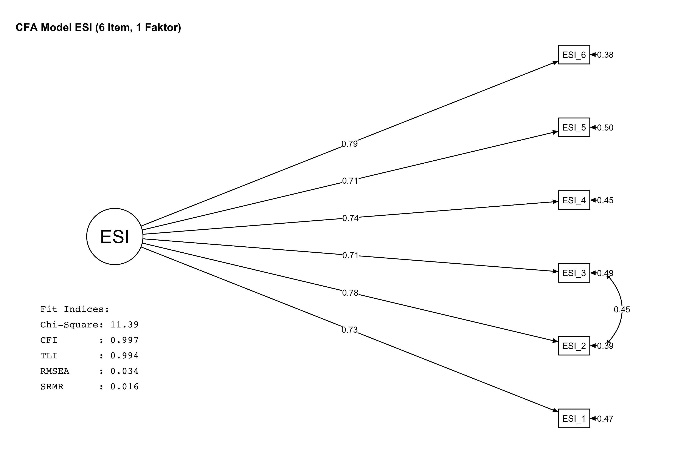
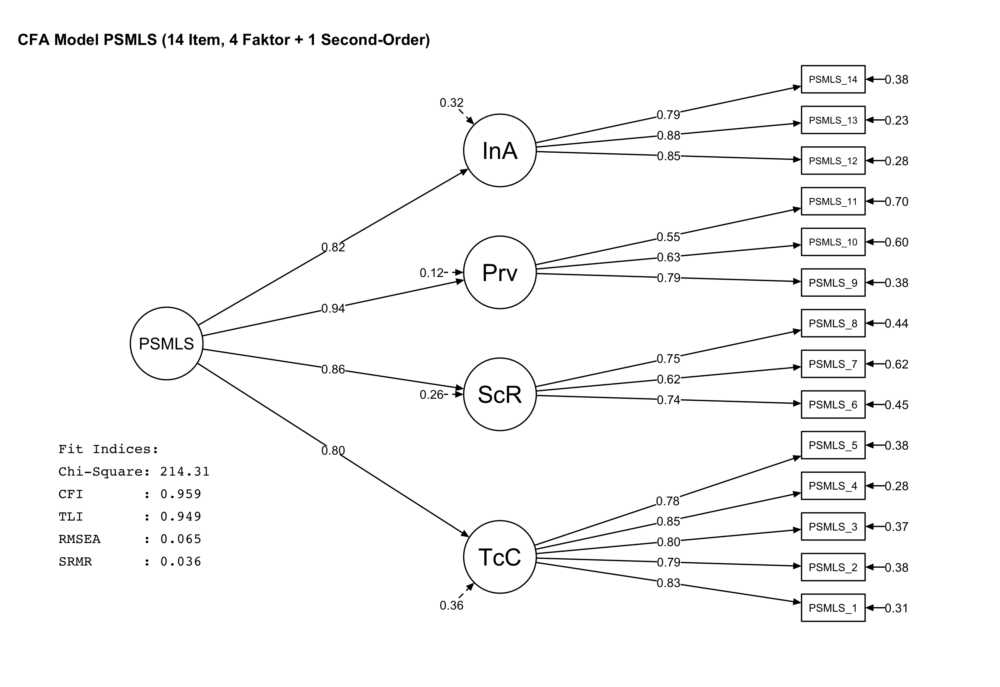
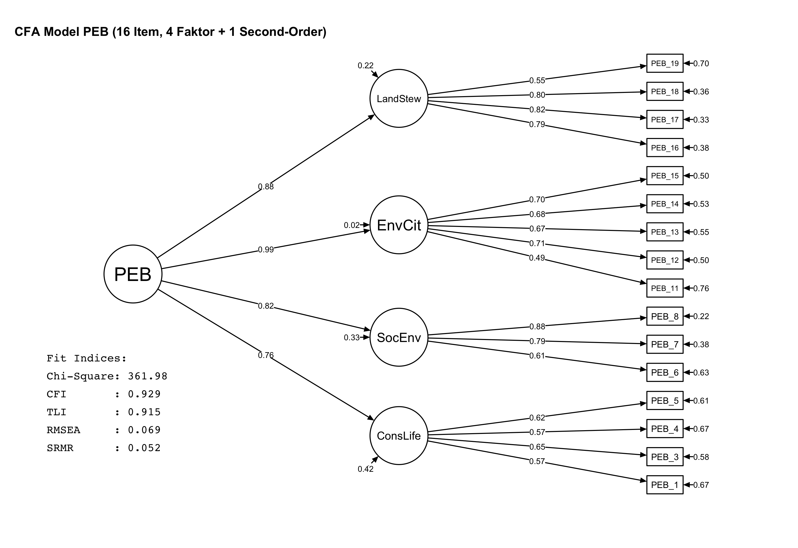
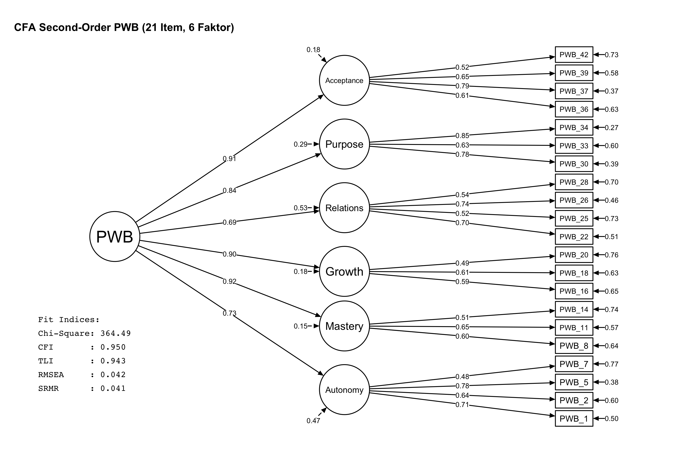
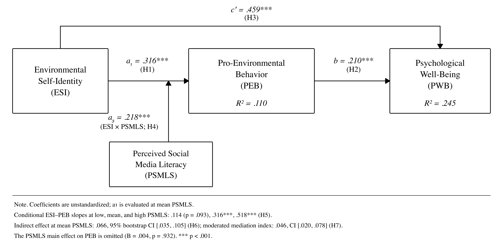
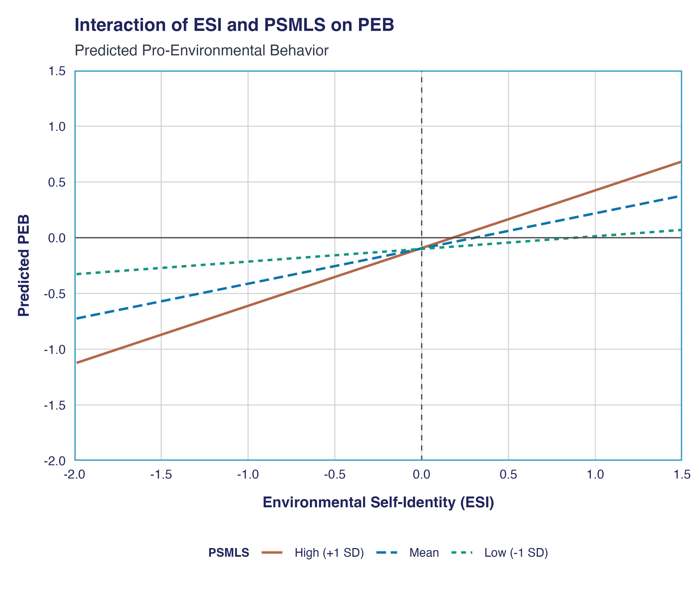
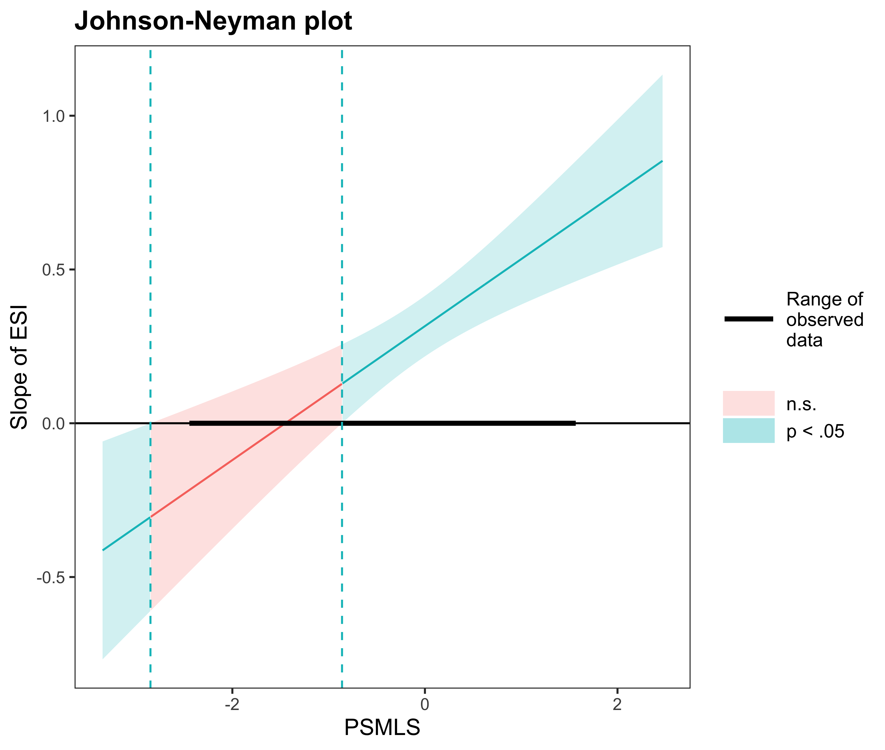

Selamat datang di publikasi hasil analisis ANECO. Halaman ini dibuat secara otomatis dari luaran skrip R.

## 1. Unduh Laporan
- [Laporan Analisis untuk Tim (DOCX)](hasil_analisis/Laporan_Hasil_Analisis_untuk_Tim.docx)
- [Laporan Lengkap (TXT)](hasil_analisis/laporan_lengkap.txt)

## 2. Visualisasi Model CFA

::: {layout-ncol=2}
### ESI

### PSMLS

### PEB

### PWB

:::

## 3. Hasil Uji Hipotesis (Model 7)

### Model 7

### Grafik Interaksi

### Grafik Johnson-Neyman

